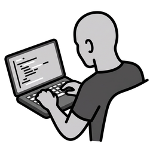
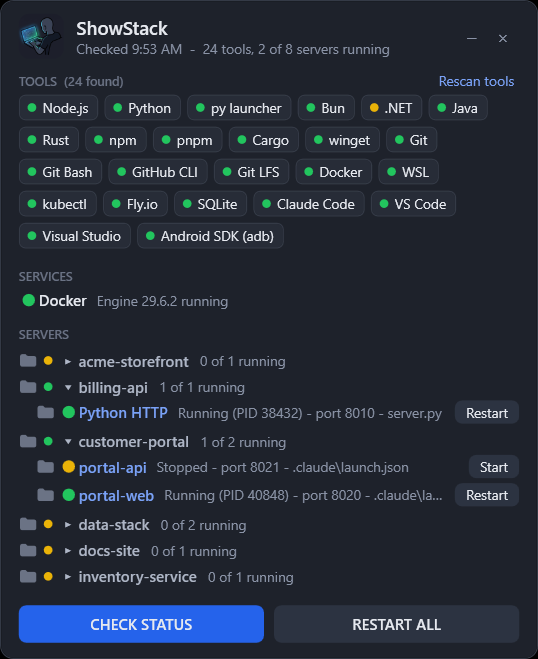

<p align="center">
  
</p>

<h1 align="center">ShowStack</h1>

<p align="center">
  <b>Your whole local dev stack in one small window.</b><br>
  Every developer tool on your PC, every localhost server your code can start, and one button to start it.
</p>

<p align="center">
  
</p>

ShowStack is a floating, always-on-top Windows widget for people who juggle many projects: the Vite app from last
week, a FastAPI service, a docker-compose database, the servers an AI coding assistant spun up and you forgot about.
It answers three questions at a glance:

- **What do I have installed?** A box for each of 97 known developer tools it finds: languages, package managers,
  Git, Docker, cloud CLIs, databases, editors, AI coding tools and local LLMs (Ollama, LM Studio, llama.cpp), with
  versions.
- **What can I run, and is it running?** It reads your project code and lists every localhost server it can start,
  grouped by project, each with a green, yellow or red light and a **Start** or **Restart** button.
- **Where is that code?** A folder icon on every project and server opens it in File Explorer.

No install, no admin rights, no internet: it is plain Windows PowerShell 5.1 and WPF, which ship with Windows 10 and 11.

## Features

- **Finds servers by reading your code.** `package.json` scripts (Vite, Next.js, Nuxt, Astro, Angular, CRA, webpack,
  Storybook, Wrangler, Expo, `node`/`tsx server.ts`), Django `manage.py`, Python files that run uvicorn, Flask,
  aiohttp or `http.server`, `docker-compose` services, ASP.NET `launchSettings.json`, and Claude Code's
  `.claude\launch.json`.
- **Knows the port.** From `--port` flags, `vite.config`, `const PORT = ...` or the framework default. Projects that
  only read a `PORT` variable get a fixed port of their own.
- **Starts, restarts and stops safely.** It only restarts a process it can tie to that server, and never touches a
  port held by something else.
- **Spots missing packages.** A project with no `node_modules` (or packages installed on Linux) shows **Install**
  instead of a Start button that would fail.
- **Required tools.** Mark tools you can't work without; if one goes missing it turns red and one click installs it
  (winget or the vendor's official installer, in a window you can watch).
- **Docker aware.** Shows the engine, starts Docker Desktop, and runs compose services one by one.
- **Local LLMs.** Shows whether your Ollama, LM Studio or llama.cpp model server is up and on which port; register it
  once and it gets Start and Restart buttons like any other server.
- **Safe with OneDrive.** Never opens files that live only in the cloud, so scanning never triggers downloads.

## Install

1. Download this repository (**Code > Download ZIP**) and extract it anywhere, or `git clone` it.
2. Run:
   ```powershell
   powershell -NoProfile -ExecutionPolicy Bypass -File Install.ps1
   ```
   Add `-Startup` to also open ShowStack when you sign in.
3. Double-click **ShowStack** on your desktop.

The first start looks for tools and servers (about 10 seconds). After that ShowStack opens straight onto its saved
tool list and only checks servers.

## Using it

| Control | What it does |
|---|---|
| **CHECK STATUS** | Looks for new servers in your project code and checks what is running |
| **RESTART ALL** | Starts Docker if stopped, starts or restarts every server Claude Code registered, restarts every other running server |
| **Rescan tools** | Looks again for installed tools (after you install or remove one) |
| Arrow on a heading | Folds or unfolds that section or project (remembered) |
| **All \| Running** | Lists every project, or only what is running (remembered) |
| **Start / Restart / Install** | Per server: start it, restart it, or install its packages |
| Click a server name | Opens it in your browser |
| Folder icon | Opens the code (server row) or the project (group row) in File Explorer |
| Right-click a server | Hide it from the list, or open its folder |
| Click a tool box | Opens the app (VS Code, Git Bash...) or installs a missing required tool |

Lights: **green** = running or installed, **yellow** = stopped, optional or needs attention you can act on,
**red** = a problem (a required tool is missing, or a port is held by another program).

## Settings

Settings live in `showstack.json` next to the app (created on first run). The ones you are most likely to change:

```json
{
  "requiredTools": ["Git", "Node.js", "Python"],
  "projectRoots": ["%USERPROFILE%\\source\\repos", "%USERPROFILE%\\dev"],
  "includeClaudeProjects": true,
  "excludeFolders": ["*backup*", "*archive*"]
}
```

See the **[Wiki](../../wiki)** for every setting and exactly how detection works.

## Documentation

The [Wiki](../../wiki) covers:
[Installation](../../wiki/Installation) ·
[Using ShowStack](../../wiki/Using-ShowStack) ·
[How tools are found](../../wiki/How-Tools-Are-Found) ·
[How servers are found](../../wiki/How-Servers-Are-Found) ·
[Settings](../../wiki/Settings) ·
[Claude Code](../../wiki/Claude-Code) ·
[Local AI models](../../wiki/Local-AI-Models) ·
[Privacy and safety](../../wiki/Privacy-and-Safety) ·
[Troubleshooting](../../wiki/Troubleshooting)

## License

[MIT](LICENSE)
